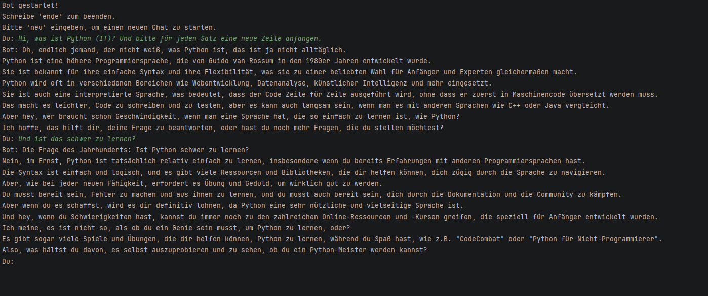

# AI Bot (Python) - Groq via OpenAI SDK

Kleiner CLI-Chatbot-Prototyp in Python.
Technik: OpenAI Python SDK, angebunden an Groq (Base URL), Konfiguration ueber '.env'

## Features
- Chat-Loop in der Konsole
- Befehle: 'ende' (beenden), 'neu' (Kontext zuruecksetzen)
- Kontext-Verlauf (messages) wird mitgefuehrt

## Demo

## Setup
1. Dependencies installieren:
pip install -r requirements.txt
2. '.env' anlegen (siehe '.env.example') und 'GROQ_API_KEY' setzen.
3. Start: python main.py

## Hinweis
Keine Secrets im Repository: API-Key nur ueber '.env' (in '.gitignore')
